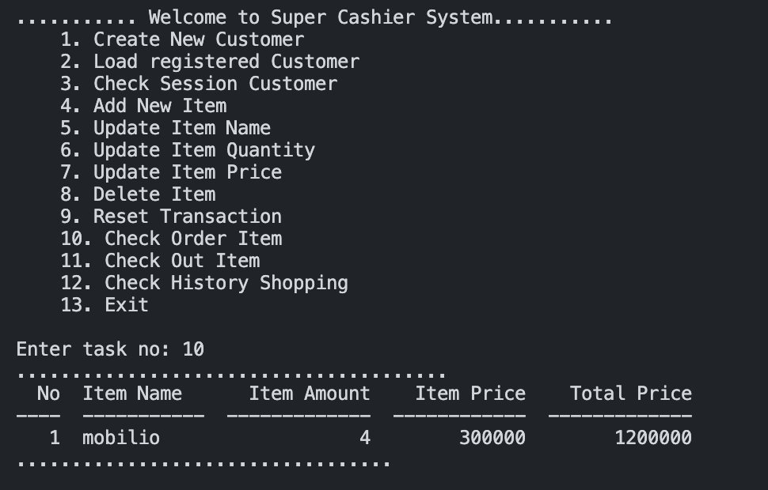

# Self-Service-Supermarket-Project

self-service supermarket used python as main programming language and sqlite database

### A. Background

Self-Service Supermarket system is a program to automate shopping which cut the Cashier Journey for efficient process. The system is used to support operational day-to-day activities at a offline/online Supermarket. For instance, Costumer can adjust item  or directly checkout item on the cart by himself.

### B. Objective

Program objective:

- Create New Customer.
- Load Existing Costumer.
- Add multiple Item to Cart
- Edit new name by item name.
- Edit new Price by item name.
- Edit new amount by item name.
- Check Order to show list of item on the cart.
- Checkout all Item.
- Check purchased History Costumer
- Change Session user.

Learning objective:

- Create programming language with python and connected to sqlite database.
- Implement application with Function or object (OOP).
- Implement Clean Codde based on PEP 8.
- Modular script.

### C. Tools

Languages:

- Python
- SQLite

Libraries: 

- Sqalchemy
- Tabular

### D. Program Description

1. Create SQLite Database with Library Sqlalchemy

- Create DB files "super-cashier.sqlite" containing 3 tables
- Table 1 - sc_customer: Contain costumer information 
- Table 2 - sc_transaction: Contain transaction information
- Table 3 - sc_item_transaction: Contain relation item and transaction 
- Output: super-cashier.sqlite


_Diagram 1: ERD for DB LMS_

2. Create Python Program

- Step 1: Import relevant modules (tabular, sqlalchemy)
- Step 2: Establish connection with database
- Step 3: Create functions for each features (reference from flowchart)


_Diagram 2: Flowchart Program_

### E. Directory Structure


_Picture 1: Directory Structure_  

- database: Initialize Connection and create sqlite database and table
- main: all the feature process
- model: get datafrom database or manipulation data
- validation: middleware for payload input
- sqlite: database based on file

### F. Setup

1. Clone this git repository into your local computer. https://github.com/agnynureza/SS-Supermarket-python.git
2. Install dependency:
    ```
    pip install -r "requirements.txt"
    ```
3. First time you need to running database.py, it will create database and table:
    ```
    python database.py
    ```
4. Execute main.py file on your terminal:
    ```
    python main.py
    ```

### G. Test Cases & Results

__Test case 1: Add New User__

- 1.A: Input New Costumer Data 


- 1.B: Load Exist Costumer Data


- 1.C: Check Costumer login 


__Test case 2: Add New Item__

- 2.A: Input New Item Data


- 2.B: Check Order Item on Cart 


- 2.C: Input Second Item Data


__Test case 3: Edit Item__ 

- 3.A: Edit New Name By Item Name


- 3.B: Edit New Amount By Item Name 


- 3.C: Edit New Price By Item Name  

    
__Test case 4: Delete item on Cart__ 

- 4.A: Delete item


- 4.B: Check after delete item



__Test case 5: Reset Transaction on Cart__

- 5.A: Reset Cart


- 5.B: Check after delete Reset Cart


__Test case 6: Check out item on Cart__

- 6.A: Check Order after add new item


- 6.B: Checkout all item on Cart


__Test case 7: Check History after Checkout__

- 7.A: History Shopping By Costumer ID


__Test case 8: Flow Validation__

- 8.A: Not Setup Costumer When add/update/checkout item


- 8.B: User Not Found when Load Data


### H. Conclusion/Future Work

1. create MVP for table costumer and transaction, then give relation many-to-many
2. costumer have session, self-service system can use by other people after finish the shopping.
3. many feature we can utilize with binding costumer and transaction like costumer point or costumer history.
4. for future work, maybe i will expand the process like table item, so costumer will give list of item,then the item can be restock by admin or sold out when costumer checkout the item.
